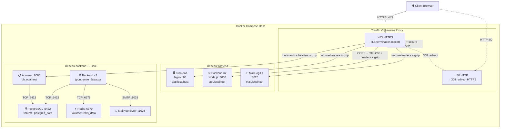

# Architecture Réseau : DevOps Foundations

Ce projet adopte une architecture microservices exécutée dans un environnement conteneurisé. Pour orchestrer et sécuriser le trafic de notre pile, cette architecture s'appuie sur une structure réseau Docker stricte gérée par **Traefik v3**.

---

## 1. Topologie des Réseaux Internes (Docker Networks)

Pour confiner et isoler la surface d'attaque interne, l'infrastructure fonctionne avec **deux sous-réseaux Docker isolés** séparant la zone publique (exposition web) de la zone de données (bases de données, cache).

### 1.1 Réseau `frontend` (Zone Publique)

- **Rôle** : Permettre à Traefik de router le trafic HTTPS vers les services exposés au navigateur client.
- **Membres** :
  - **Traefik** — reverse proxy, seul point d'entrée réseau hôte.
  - **Frontend** (Nginx) — sert le dashboard statique HTML/CSS/JS.
  - **Backend** (Node.js) — expose l'API REST via Traefik (`api.localhost`).
  - **MailHog** — interface web de consultation des emails de test.

### 1.2 Réseau `backend` (Zone Privée)

- **Rôle** : Zone sécurisée hébergeant les bases de données et les services internes. Aucun de ces services n'est directement accessible depuis le navigateur sans passer par Traefik.
- **Membres** :
  - **Traefik** — nécessaire pour router vers Adminer (connecté uniquement ici).
  - **Backend** (Node.js) — pont entre les deux réseaux : reçoit le trafic HTTP via `frontend`, accède aux données via `backend`.
  - **PostgreSQL** — base de données relationnelle. **Uniquement sur ce réseau.**
  - **Redis** — cache / compteur de visites. **Uniquement sur ce réseau.**
  - **MailHog** — réception SMTP depuis le backend (port 1025).
  - **Adminer** — interface d'administration de PostgreSQL. **Uniquement sur ce réseau**, protégé par Basic Auth.

### 1.3 Tableau récapitulatif

| Service         | Réseau `frontend` | Réseau `backend` | Port interne | Hostname Traefik       |
|-----------------|:------------------:|:-----------------:|:------------:|------------------------|
| Traefik         | ✅                 | ✅                | 80 / 443     | `traefik.localhost`    |
| Frontend        | ✅                 | —                 | 80           | `app.localhost`        |
| Backend (×2)    | ✅                 | ✅                | 3000         | `api.localhost`        |
| MailHog         | ✅                 | ✅                | 8025 / 1025  | `mail.localhost`       |
| PostgreSQL      | —                  | ✅                | 5432         | —                      |
| Redis           | —                  | ✅                | 6379         | —                      |
| Adminer         | —                  | ✅                | 8080         | `db.localhost`         |

> **Principe de sécurité** : PostgreSQL et Redis ne sont jamais sur le réseau `frontend`. Adminer est isolé sur `backend` et protégé par Basic Auth via Traefik.

---

## 2. Le Reverse Proxy (Traefik v3)

Traefik est le **seul service exposant des ports sur la machine hôte** (`:80` et `:443`). Aucun port applicatif n'est publié directement.

### 2.1 EntryPoints

| EntryPoint   | Port  | Comportement                                                  |
|--------------|-------|---------------------------------------------------------------|
| `web`        | `:80` | Redirige automatiquement vers `websecure` (308 Permanent)     |
| `websecure`  | `:443`| Termine le TLS avec des certificats locaux générés par mkcert |

### 2.2 Routage Dynamique (Docker Provider)

Traefik découvre les services automatiquement via les labels Docker (`traefik.enable=true`). Chaque service déclare son hostname via `Host(...)` dans ses labels.

| Hostname             | Service cible    | Middlewares appliqués                              |
|----------------------|------------------|----------------------------------------------------|
| `app.localhost`      | Frontend (Nginx) | `secure-headers`, `gzip-compression`               |
| `api.localhost`      | Backend (Node.js)| `backend-cors`, `api-rate-limit`, `secure-headers`, `gzip-compression` |
| `traefik.localhost`  | Dashboard interne| `dashboard-basic-auth`, `secure-headers`           |
| `db.localhost`       | Adminer          | `dashboard-basic-auth`, `secure-headers`, `gzip-compression` |
| `mail.localhost`     | MailHog web UI   | `secure-headers`, `gzip-compression`               |

### 2.3 Middlewares

| Middleware               | Type        | Rôle                                                                |
|--------------------------|-------------|---------------------------------------------------------------------|
| `secure-headers`         | Headers     | HSTS (1 an, includeSubdomains, preload), frameDeny, contentTypeNosniff, browserXssFilter |
| `api-rate-limit`         | RateLimit   | 100 req/s average, burst 50 — protège l'API contre les abus        |
| `dashboard-basic-auth`   | BasicAuth   | Protège le dashboard Traefik et Adminer (credentials via `.env`)    |
| `backend-cors`           | Headers     | Autorise les appels cross-origin depuis `app.localhost` uniquement  |
| `gzip-compression`       | Compress    | Compression des réponses HTTP                                       |

### 2.4 TLS Local (mkcert)

Les certificats sont générés localement via `mkcert` pour tous les domaines `*.localhost` et montés en read-only dans le conteneur Traefik (`/certs/`). La configuration TLS est déclarée dans `traefik/dynamic/tls.yml`.

---

## 3. Schéma d'Architecture

---

## 4. Justifications de Sécurité

| Décision                                    | Justification                                                                 |
|---------------------------------------------|-------------------------------------------------------------------------------|
| Ports hôte limités à `:80` / `:443`         | Aucun port applicatif exposé — conformité CTO, réduction de la surface d'attaque |
| PostgreSQL / Redis uniquement sur `backend`  | Isolation stricte des données : aucun accès direct depuis le réseau public    |
| Basic Auth sur dashboard et Adminer          | Protection des interfaces d'administration sensibles                          |
| Credentials via `.env` (gitignored)          | Aucun secret dans le code versionné                                           |
| Conteneurs non-root (backend, frontend)      | Principe du moindre privilège                                                 |
| HSTS + security headers sur toutes les routes| Protection contre les attaques XSS, clickjacking, sniffing                   |
| Rate limiting sur l'API                      | Protection contre les abus et le déni de service                              |
| TLS local via mkcert                         | Chiffrement du trafic même en développement local                             |
| Volumes nommés pour PostgreSQL et Redis      | Persistance des données garantie entre redémarrages                           |
