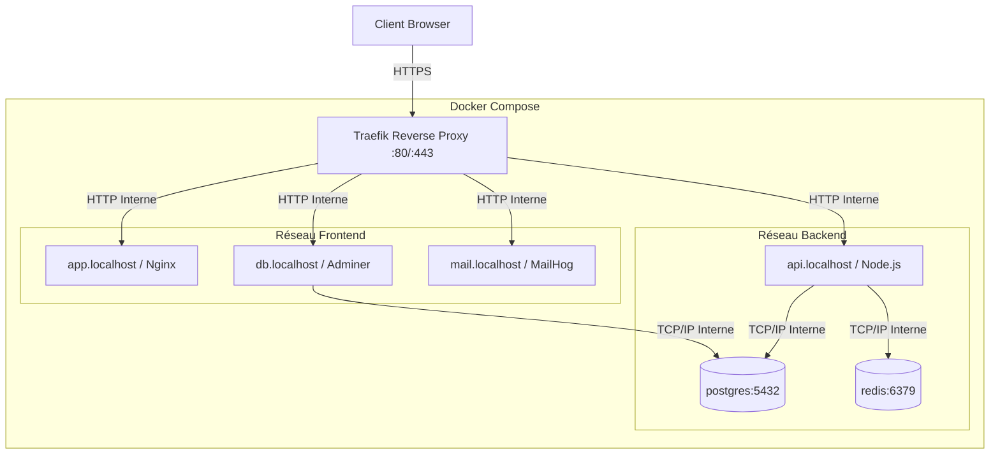

# Architecture Réseau : DevOps Foundations

Ce projet adopte une architecture microservices exécutée dans un environnement conteneurisé. Pour orchestrer et sécuriser le trafic de notre pile, cette architecture s'appuie sur une structure réseau Docker stricte gérée par **Traefik**.

## 1. Topologie des Réseaux Internes (Docker Networks)

Pour confiner et isoler géographiquement la surface d'attaque interne, le réseau Docker `devops-foundations` fonctionne avec deux sous-réseaux majeurs (isolant la "zone publique" de la "zone de données").

1. **`frontend` (Réseau Public & Front-Office)**
   - **Rôle**: Gérer les connexions HTTP des passerelles web et exposer les interfaces utilisateur isolées. 
   - **Membres**: Traefik, Frontend (Vue / Nginx), Adminer, MailHog.

2. **`backend` (Réseau Privé & Back-Office)**
   - **Rôle**: Zone hautement sécurisée qui protège les données. Elle traite la logique métier et héberge nos bases de données. Ce réseau ne doit en **aucun cas** être exposé directement aux requêtes HTTP externes non routées.
   - **Membres**: Traefik, Backend (Node.js), Adminer, PostgresDB, Redis DB, MailHog.

## 2. Le Reverse Proxy (Traefik v3)

Traefik écoute la surface Host Docker (port 80 / 443 TCP) de l'hôte distant et intercepte **absolument tout** le trafic entrant.

### Rôles du Proxy:
- **Portes d'Entrées (EntryPoints)**:
  - `web` (80) : Redirige dynamiquement tout trafic HTTP pur vers HTTPS `websecure` (Status `308 Permanent Redirect`).
  - `websecure` (443) : Accepte uniquement les connexions TLS.
- **Routage Dynamique**: 
  - Traefik récupére nativement les labels Docker (ex: `Host('app.localhost')`) pour savoir dans quel conteneur précis encapsuler la requête sans exposition des ports locaux.
- **Sécurité et Transport (Middlewares)**:
  - Traefik chiffre intégralement TLS (automatisé via base locale CA mkcert sur macOS).
  - Traefik ajoute l'en-tête de restriction (via les Middlewares : `secure-headers`, `api-rate-limit`, `gzip-compression`).
  - La route du Dashboard Traefik et des composants d'administration sensibles sont verrouillés par le hash d'Auth basique.

## 3. Schéma Simplifié

